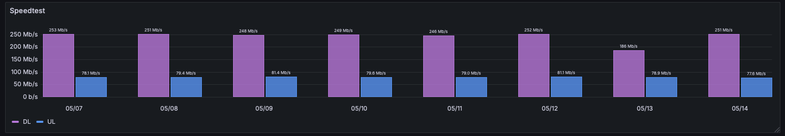

# speedtest-exporter

[](https://goreportcard.com/report/github.com/mgumz/speedtest-exporter)

**speedtest-exporter** periodically executes [speedtest-go] to given servers and provides the
measured results as [prometheus] metrics on an HTTP endpoint.

Usually, [speedtest-go] is producing the following output:

    $> speedtest-go -s 00001

        speedtest-go v1.7.10 (git-dev) @showwin

    ⠸ Retrieving User Information
    ✓ ISP: 192.0.2.1 (ACME Sponsor) [0.123, 0.456]
    ✓ Found 1 Specified Public Server(s)

    ✓ Test Server: [00001] 2.78km Example City by ACME Sponsor
    ✓ Latency: 13.266299ms Jitter: 1.563479ms Min: 11.066208ms Max: 16.269875ms
    ✓ Packet Loss Analyzer: Running in background (<= 30 Secs)
    ✓ Download: 56.17 Mbps (Used: 71.18MB) (Latency: 40ms Jitter: 9ms Min: 16ms Max: 53ms)
    ✓ Upload: 54.34 Mbps (Used: 71.26MB) (Latency: 46ms Jitter: 30ms Min: 16ms Max: 121ms)
    ✓ Packet Loss: N/A

`speedtest-exporter` exposes the measured values like this:

    # 1 speedtest jobs defined
    # speedtest run speedtest-exporter-cli: 2025-04-13T13:43:46.002883Z -- speedtest-go --json -s 00001
    speedtest_runs_total{speedtest_exporter_job="speedtest-exporter-cli",error=""} 1 1744551826002
    speedtest_duration_seconds{speedtest_exporter_job="speedtest-exporter-cli"} 23.945700 1744551826002
    speedtest_dl_speed{speedtest_exporter_job="speedtest-exporter-cli"} 7120217 1744551826002
    speedtest_ul_speed{speedtest_exporter_job="speedtest-exporter-cli"} 6932864 1744551826002
    speedtest_jitter{speedtest_exporter_job="speedtest-exporter-cli"} 1477440 1744551826002
    speedtest_latency{speedtest_exporter_job="speedtest-exporter-cli"} 14383537 1744551826002
    speedtest_max_latency{speedtest_exporter_job="speedtest-exporter-cli"} 18016083 1744551826002
    speedtest_min_latency{speedtest_exporter_job="speedtest-exporter-cli"} 12627166 1744551826002
    speedtest_test_duration_ping{speedtest_exporter_job="speedtest-exporter-cli"} 2425575666 1744551826002
    speedtest_test_duration_download{speedtest_exporter_job="speedtest-exporter-cli"} 10051649083 1744551826002
    speedtest_test_duration_upload{speedtest_exporter_job="speedtest-exporter-cli"} 10050837042 1744551826002
    speedtest_test_duration_total{speedtest_exporter_job="speedtest-exporter-cli"} 22528061791 1744551826002

When [prometheus] scrapes the data, you can visualise the observed values:



## Usage

    Usage: speedtest-exporter [FLAGS] -- [SPEEDTEST-GO-FLAGS]

    FLAGS:
    -bind       <bind-address>
                bind address (default ":8080")
    -h
                show help
    -jobs       <path-to-jobsfile>
                file describing multiple speedtest-jobs. syntax is given below.
    -label      <job-label>
                use <job-label> in prometheus-metrics (default: "speedtest-exporter-cli")
    -log-level  <log-level>
                either of "debug", "info" (default), "warn", "error"
    -speedtest  <path-to-binary>
                path to speedtest-go binary (default: "speedtest-go")
    -schedule   <schedule>
                schedule at which often speedtest-go is launched (default: "@every 24h")
                examples:
                   @every <dur>  - example "@every 24h"
                   @hourly       - run once per hour
                   10 * * * *    - execute 10 minutes after the full hour
                see https://en.wikipedia.org/wiki/Cron
    -timeshift  <timeshift>
                timeshift around the point in time when -schedule would trigger otherwise
                (default: "" - no timeshift)
    -watch-jobs <schedule>
                periodically watch the file defined via -jobs (default: "")
                if it has changed stop previously running speedtest-jobs and apply
                all jobs defined in -jobs.
    -show-license
                show license
    -show-version
                show version

    SPEEDTEST-GO-FLAGS:
    see "speedtest-go" for valid flags.

At `/metrics` the measured values of the last run are exposed.

### Examples

    $> speedtest-exporter -schedule "@every 24h" -- -s 00001

### Jobs-File Syntax

    # comment lines start with '#' are ignored
    # empty lines are ignored as well
    label -- <schedule> -- speedtest-go-flags

`<schedule>` - a schedule expression which follows one of

* `* * * * *` - a cron expression, see https://en.wikipedia.org/wiki/Cron
* `@hourly` | `@daily` etc - see https://pkg.go.dev/github.com/robfig/cron/v3#hdr-Predefined_schedules
* `@every <duration>` - execute [speedtest-go] in an interval

Optionally, if the `<schedule>` has a suffix of `<timeShiftSpec>`, the actual
execution of the job is, well, shifted. This is a **very** advisable feature to
use: `speedtest` usually causes a noticeable amount of traffic, not only on
the users side but _mainly_ on the server side as well as the hops in between.

**NOTE**: To minimize the concerted effect a `speedtest` run might cause: use
`timeshifts` to deviate or to delay the actual execution by a random amount!

`<timeShiftSpec>` - Different timeshift expressions in the Jobs-File are supported.

* `±<duration>` - adds random deviaton of <duration> the otherwise planned point in time.
                Example given: `@every 1h ±7m` will trigger the job somewhen in
                the range of xx:53 to yy:07. The effective range is given as
                `[-<duraction> .. <planned-point-in-time .. +<duration>]`.
* `~<duration>` - adds a random delay to the otherwise planned point in time.
                  Example given: `@every 1h ~ 10m` will trigger the job
                  somewhen in the range of xx:00 to xx:10. The effective range
                  is given as `[<planned-point-in-time .. +<duration>]`.

Examples:

    # measure each midnight ± 10 minutes the speed to server 00001
    nightly -- @midnight ±10m -- -s 00001
    # measure only connectivity every hour, no real up or download
    connectivity -- @every 1h -- -s 00001 --no-upload --no-download
    # measure first of month
    monthly -- 0 * 1 * * -- -s 00001


### Signals

* USR1 - print the currently active schedule of jobs to the logs


## Requirements

Runtime:

* speedtest-go
* a reachable speedtest server (see [here](https://support.ookla.com/hc/en-us/articles/234578528-OoklaServer-Installation-Linux-Unix) to host your own)

Build:

* golang-1.24 and newer

## Building

    $> git clone https://github.com/mgumz/speedtest-exporter
    $> cd speedtest-exporter
    $> make

One-off building and "installation":

    $> go install github.com/mgumz/speedtest-exporter/cmd/speedtest-exporter@latest

## OCI Images

OCI images for `linux/amd64` platform are available for recent releases under
https://github.com/mgumz/speedtest-exporter/pkgs/container/speedtest-exporter

Make sure to preserve the ENTRY command to benefit from the default
[krallin/tini](s://github.com/krallin/tini) zombie. In kubernetes, this
translates into omitting the `command` and only specifying `args` for passing
speedtest-exporter
```yaml
      containers:
        - name: speedtest-prometheus-collector
          image: ghcr.io/mgumz/speedtest-exporter:<version>

          # Note: We need to override the container entry point which is an
          # array ENTRYPOINT ["/sbin/tini", "--", "/usr/bin/speedtest-exporter"]
          # Only the fist element end up in the container `command`, and the two
          # others end up in the default `args` value
          command:
            - "/sbin/tini"
            - "--"
            - "/usr/bin/speedtest-exporter"
            - "-schedule"
            - "@every 24h"
            - "--"
            - "-s"
            - "00001"
```

## License

see LICENSE file

## Author(s)

* Mathias Gumz <mg@2hoch5.com>

## Related Projects

[speedtest-go]: https://github.com/showwin/speedtest-go
[prometheus]: https://prometheus.io
[speedtest-homeassistant]: https://www.home-assistant.io/integrations/speedtestdotnet

